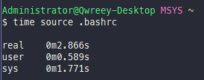
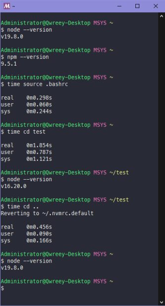
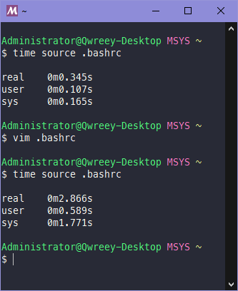

# What is fnvm?

<div align=center>



wow nvm takes almost 2 seconds to initialize!

</div>

fnvm is some hacky method that makes nvm much faster in cygwin.  
In cygwin, nvm makes bash slower. even it takes 2~10 second to initialize  
fnvm using ~/.nvmrc.cached which created by user and contain cached node version to set PATH directly without calling nvm's version resolver which is very slow due to checking system installed nodejs and iojs, resolving all of installed nodes.  

It also includes auto version changing when change cwd  



# Installation

If nvm is not installed, install nvm first
```
curl -o- https://raw.githubusercontent.com/nvm-sh/nvm/v0.39.3/install.sh | bash
```

Next, install fnvm
```
git clone https://github.com/qwreey75/fnvm.git ~/.nvm/fnvm --depth 1
source ~/.nvm/fnvm/fnvm.sh; fnvm_update
```

Done! If you want update fnvm, simply type `fnvm_update`

# Configure

you can insert these setting above `source $HOME/.nvm/fnvm/fnvm.sh; fnvm_init` in your rc file

```
export FNVM_DISABLE_CD="no" # If this value is "yes". auto version changing will be disabled
```

[ -s "$NVM_DIR/bash_completion" ] && \. "$NVM_DIR/bash_completion"  # This loads nvm bash_completion

# How much fast is?

In cygwin, Normal nvm takes ~2 second, but fnvm only takes 0.2 second! Almost ten times faster then normal nvm.


